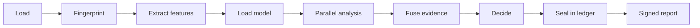
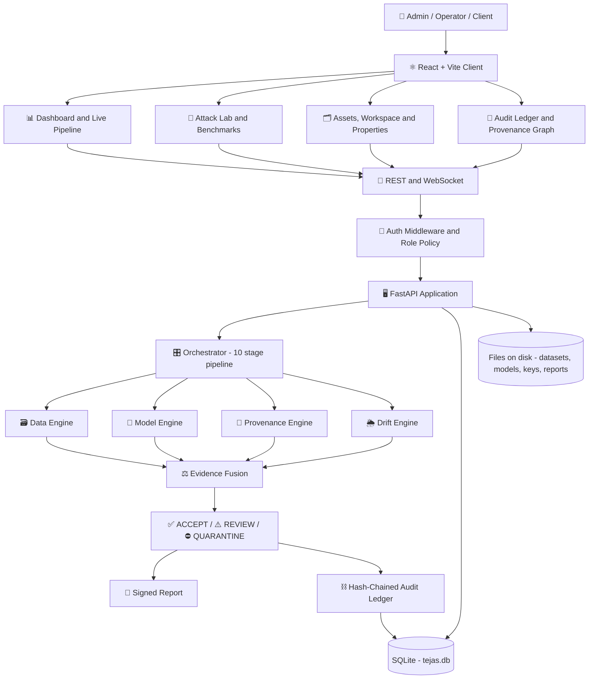
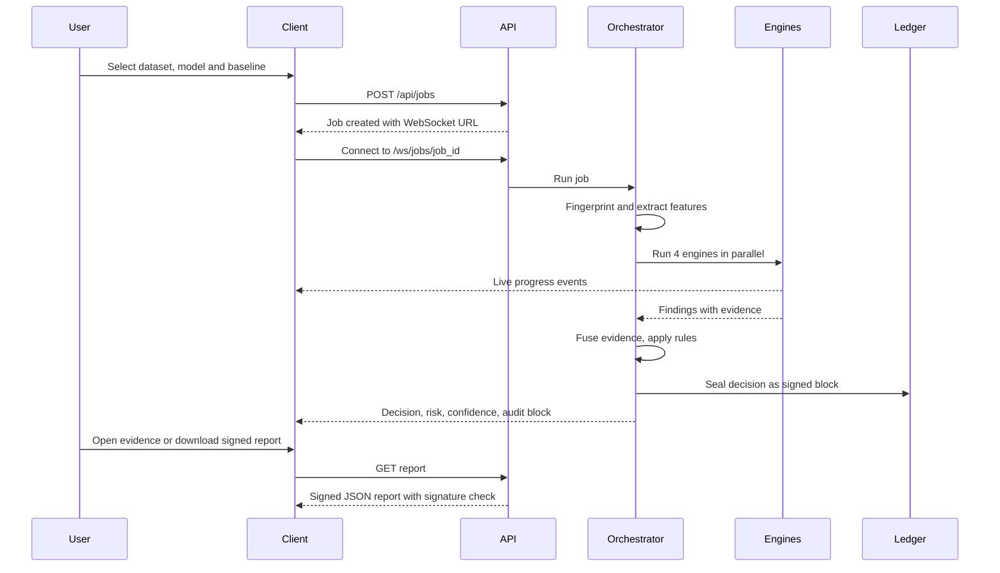
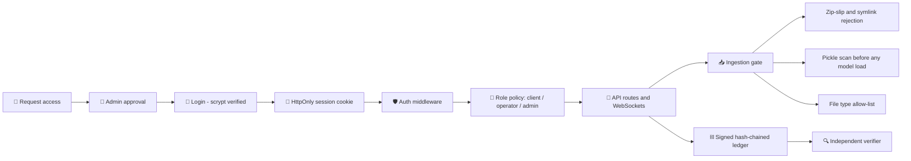

<div align="center">



<br/>

**An offline assurance layer that verifies the data, the model and the outputs of a computer-vision pipeline, then proves every decision.**

<br/>


</div>

---

## Table of Contents

1. [Overview](#1-overview)
2. [Key Features](#2-key-features)
3. [How It Works](#3-how-it-works)
4. [Architecture](#4-architecture)
5. [Tech Stack](#5-tech-stack)
6. [Project Structure](#6-project-structure)
7. [Getting Started](#7-getting-started)
8. [Data Setup and Ingestion](#8-data-setup-and-ingestion)
9. [Configuration](#9-configuration)
10. [Usage](#10-usage)
11. [Security and Access Control](#11-security-and-access-control)
12. [Testing and Benchmarks](#12-testing-and-benchmarks)
13. [Troubleshooting](#13-troubleshooting)
14. [Project Status and Limitations](#14-project-status-and-limitations)
15. [Roadmap](#15-roadmap)
16. [Contributing](#16-contributing)
17. [License](#17-license)

---

## 1. Overview

Computer-vision systems depend on datasets, pretrained models and third-party components whose integrity is usually **assumed rather than verified**. A poisoned dataset, a hidden backdoor or a silently swapped model can make a system fail exactly when it matters, and without evidence nobody can tell what went wrong.

**TEJAS-CV** sits around an existing computer-vision pipeline. It does **not** replace the pipeline and it does not retrain anything. It independently examines the **dataset**, the **model**, the **inference outputs** and the **contributors**, fuses the evidence into an explainable risk score, returns **ACCEPT**, **REVIEW** or **QUARANTINE**, and seals every decision into a signed, hash-chained audit ledger.

Everything runs **offline**. There are no network calls at runtime.

| Step | What TEJAS-CV does |
|---|---|
| **Detect** | Four parallel engines screen the data, the model, the provenance and the distribution shift |
| **Explain** | Every finding carries a reason, evidence, confidence, severity and a recommendation |
| **Prove** | SHA-256 fingerprints, Merkle proofs, Ed25519 signatures and a hash-chained ledger, checkable by an independent verifier |
| **Decide** | Evidence fusion returns ACCEPT, REVIEW or QUARANTINE with the rules that fired |

### Verdicts at a glance

| Scenario | What happens | Verdict |
|---|---|---|
| Trusted pipeline | Clean batch, approved model, valid provenance | ✅ **ACCEPT** |
| Dataset poisoning | Trigger-patch poisoning, label conflicts, files altered after signing | ⛔ **QUARANTINE** |
| Model substitution or backdoor | A validly signed model hiding a trigger backdoor | ⛔ **QUARANTINE** |
| Silent weight tampering | Same architecture, modified weights | ⛔ **QUARANTINE** |
| Inference tampering | A stored inference output edited after the fact | ⛔ **QUARANTINE** |
| Distribution shift | Night, haze or blur batch | ⚠️ **REVIEW** (drift is not an attack) |
| Malformed or malicious upload | Path traversal, no images, malicious pickle, disallowed file type | 🚫 **REJECTED** at ingestion |
| Replayed inference record | A valid record presented a second time | 🚫 **REJECTED** |

---

## 2. Key Features

### 🔎 Assurance engines
- **Data Integrity:** unreadable files, exact and near duplicates, cross-label conflicts, class-distribution shift, label consistency, recurring trigger-artifact screening, per-label outliers, contributor attribution
- **Model Integrity:** pickle scan, signed trusted-registry comparison, structural inspection, behavioural fingerprint, controlled trigger testing with attack-success-rate reporting
- **Provenance and Tamper Evidence:** Merkle re-hash of datasets, signed manifests, contributor signatures, inference chain and ledger verification
- **Shift and Drift:** out-of-distribution rate, MMD permutation test, KS tests and named environmental conditions

### 🔗 Cryptographic audit trail
- SHA-256 per file and a Merkle root per dataset
- Ed25519-signed, hash-chained audit blocks
- Signed assurance reports, training records and benchmark results
- An **independent verifier** that imports no TEJAS-CV code

### 🧪 Built-in test lab
- Six reproducible attack scenarios with an **Execute all** option and live step highlighting
- A real CNN trainer (NumPy backpropagation, exported to ONNX), optionally trained on poisoned data
- Benchmark suites scored against signed answer keys
- Synthetic test packs with known outcomes: ACCEPT, REVIEW, QUARANTINE and REJECTED

### 👥 Access control
- Request-access flow with administrator approval
- Three roles: **Admin**, **Operator** and **Client**
- Every upload, training run, assessment and inference is attributed to the account that performed it

### 🗺️ Forensics and visibility
- Live pipeline view driven by WebSocket events
- Provenance graph showing people, data sources, engines, the decision and the sealed block, with timestamps
- Per-image **Properties** dialog: General, Digital Signatures, Security, Details and Previous Versions
- Command-centre dark interface and a public landing page

---

## 3. How It Works

### Job pipeline



### The four engines

| Engine | Examines | Example findings |
|---|---|---|
| **Data Integrity** | Dataset files, labels, statistics | Conflicting duplicates, recurring trigger artifact, label inconsistency, suspicious contributor |
| **Model Integrity** | Model file and behaviour | Pickle with dangerous imports, weights modified, substitution, trigger anomaly |
| **Provenance and Tamper** | Hashes, signatures, chains | Manifest mismatch, files changed after signing, altered inference record, compromised ledger |
| **Shift and Drift** | Distribution versus a clean baseline | High out-of-distribution rate, MMD shift, night, haze or blur conditions |

### Fusion and decision rules

Engine scores are combined with noisy-OR, then weighted. Thresholds: **ACCEPT** below 35, **REVIEW** from 35 to 69, **QUARANTINE** from 70, plus explicit rules that are always reported:

| Rule | Effect |
|---|---|
| **R1** | Any critical evidence leads to QUARANTINE |
| **R2** | A high-confidence model or provenance integrity failure leads to QUARANTINE |
| **R3** | Two or more high data findings lead to QUARANTINE (one leads to REVIEW) |
| **R4** | A model without a trusted fingerprint is never auto-accepted (at least REVIEW) |
| **R5** | Significant distribution shift leads to REVIEW |
| **R6** | Drift alone never causes QUARANTINE |

Confidence is reduced when some checks could not run (coverage).

---

## 4. Architecture

### System architecture



### Assessment workflow



---

## 5. Tech Stack

| Layer | Technology | Purpose |
|---|---|---|
| Backend | Python 3.10+, FastAPI, Uvicorn | REST and WebSocket API |
| Data | SQLAlchemy, SQLite (WAL) | Embedded database, no server required |
| Analysis | ONNX Runtime, NumPy, SciPy | Model inference, statistics, CNN trainer |
| Images | Pillow, ImageHash | Image handling and perceptual hashing |
| Trust | `cryptography` (Ed25519), SHA-256, Merkle trees | Signatures, fingerprints, inclusion proofs |
| Accounts | scrypt (standard library) | Password hashing |
| Frontend | React, TypeScript, Vite | User interface and build tooling |
| UI libraries | Tailwind CSS, Framer Motion, Recharts, React Flow, TanStack Query | Styling, motion, charts, provenance graph, data fetching |
| Testing | pytest | Backend test suite |

*Optional:* PyTorch for TorchScript models, and DINOv2 (local weights) for stronger embeddings.

---

## 6. Project Structure

```bash
tejas-cv/
│
├── backend/
│   ├── app/
│   │   ├── api/             # REST and WebSocket routers
│   │   ├── auth/            # Password hashing, sessions, role policy, middleware
│   │   ├── core/            # hashing, merkle, keys, ledger, events, actor
│   │   ├── engines/         # data, model, provenance, drift, behaviour probes
│   │   ├── fusion/          # Evidence fusion and decision rules
│   │   ├── adapters/        # ONNX, TorchScript, pickle scanner, detection adapter
│   │   ├── features/        # Image statistics and embedders
│   │   ├── formats/         # CIFAR-10, GTSRB, corruptions, COCO, YOLO
│   │   ├── attacks/         # Dataset, model and inference attack generators
│   │   ├── ml/              # NumPy CNN, trainer, demo data
│   │   ├── benchmarks/      # Metrics (AUROC, TPR at fixed FPR)
│   │   ├── orchestrator/    # 10-stage job pipeline
│   │   ├── services/        # ingestion, baseline, inference, jobs, demo
│   │   ├── demo/            # Reproducible attack-lab data generator
│   │   ├── config.py
│   │   ├── database.py
│   │   └── main.py
│   │
│   ├── scripts/             # Command-line tools (see Section 10.3)
│   ├── tests/               # pytest suite
│   ├── benchmarks/          # catalog.yaml (public dataset catalogue)
│   ├── data/                # ⚠ GENERATED at runtime, NOT in git (see Section 8)
│   ├── requirements.txt
│   ├── requirements-dev.txt
│   └── Dockerfile
│
├── frontend/
│   ├── public/
│   ├── src/
│   │   ├── api/             # API client, endpoints, query keys
│   │   ├── realtime/        # Shared event socket and job stream
│   │   ├── components/
│   │   ├── pages/
│   │   ├── landing/         # Public landing page
│   │   └── types/
│   ├── package.json
│   └── vite.config.ts
│
├── docs/
│   └── banner.svg           # Animated README banner
│
├── start-backend.ps1
├── start-frontend.ps1
├── docker-compose.yml
└── README.md
```

> `backend/data/` is created on first run and is listed in `.gitignore`, so **a fresh clone has no datasets, models, accounts or database**. Section 8 explains how to generate all of it.

---

## 7. Getting Started

> ⚠️ **A fresh clone contains code only.** The datasets, models, database and signing keys live in `backend/data/`, which is not stored in git. Follow step 7.4 below and **[Section 8](#8-data-setup-and-ingestion)** to create the data. The minimum is one command: `python scripts/run_demo.py clean`.

### 7.1 Prerequisites

| Requirement | Version |
|---|---|
| Python | 3.10 or newer (64-bit) |
| Node.js | 20 or newer (current LTS recommended) |
| Git | any recent version |

### 7.2 Clone the repository

```bash
git clone https://github.com/LoganthP/SIH2026.git tejas-cv
cd tejas-cv
```

### 7.3 Set up the backend

**Windows (PowerShell):**

```powershell
cd backend
python -m venv .venv
.venv\Scripts\Activate.ps1
pip install -r requirements-dev.txt
```

If PowerShell blocks the activation script, run once: `Set-ExecutionPolicy -Scope CurrentUser RemoteSigned`

**Linux / macOS:**

```bash
cd backend
python3 -m venv .venv
source .venv/bin/activate
pip install -r requirements-dev.txt
```

### 7.4 Create the data (before the first start)

Still inside `backend/` with the virtual environment active:

```bash
python scripts/run_demo.py clean
```

This creates the database, the signing keys, the Attack Lab datasets and models, and runs one clean assessment (about 10 seconds). For the full set of data and all options, see [Section 8](#8-data-setup-and-ingestion).

### 7.5 Start the backend

```bash
python -m uvicorn app.main:app --host 127.0.0.1 --port 8000
```

Expected output:

```text
INFO:     Uvicorn running on http://127.0.0.1:8000 (Press CTRL+C to quit)
INFO:     Application startup complete.
```

> The module is `app.main:app` (not `app:app`). Avoid `--reload` during demos, because each restart drops live connections.
> On Windows you can start the backend from the repository root with `.\start-backend.ps1`.

Interactive API documentation: **http://127.0.0.1:8000/docs**

### 7.6 Set up and start the frontend

In a second terminal:

```bash
cd frontend
npm install
npm run dev
```

Open **http://127.0.0.1:5173**. The Vite dev server proxies `/api` and `/ws` to the backend, so no extra configuration is needed. On Windows: `.\start-frontend.ps1`.

### 7.7 First run

1. Open `http://127.0.0.1:5173` and choose **Request access**.
2. Create the first account. **The first account ever created becomes the administrator.** Every later sign-up is a pending request that an administrator approves.
3. Sign in. **Assets and Registry** now lists the demo datasets and models created in step 7.4. If you skipped that step, open **Attack Lab** and press **Initialise Attack Lab** instead.
4. Run the scenarios in **Attack Lab**, or use the split button to **Execute all remaining steps**.

*Locked out?* Create or reset an administrator from the command line:

```bash
cd backend
python scripts/create_admin.py --username your.name
```

### 7.8 Docker (optional, backend only)

```bash
docker compose up --build
```

The container starts with an empty data volume. Create the data inside it, for example `docker compose exec backend python scripts/run_demo.py clean`.

### 7.9 Production build of the frontend

```bash
cd frontend
npm run build
```

Serve the `dist/` folder from any static file server. No external assets are required, so it works offline. Set `VITE_API_URL` when the API is on a different origin.

---

## 8. Data Setup and Ingestion

### 8.1 Why the data is not in the repository

`backend/data/` holds the SQLite database, the **private signing keys**, uploaded datasets, models and signed reports. It is large, specific to one installation and sensitive, so it is git-ignored on purpose. **Everything in it can be regenerated** with the commands below.

Each installation creates **its own Ed25519 signing key** on first start. Reports and ledgers produced on one machine will not verify against another machine's key. Never commit `backend/data/keys/`.

### 8.2 What gets created

| Location in `backend/data/` | Created by | Contents |
|---|---|---|
| `tejas.db` | First start of the API or any script | Accounts, assets, jobs, findings, audit ledger |
| `keys/` | First start | Platform Ed25519 key pair |
| `demo_src/`, `datasets/`, `models/`, `baselines/` | Attack Lab initialisation | 4 synthetic datasets (reference, clean batch, poisoned batch, drift batch), 3 ONNX models (approved, vendor update with a hidden backdoor, patched weights), 3 contributors, a reference baseline, and the approved-model registry entry `aerial-landcover-v1` |
| `reports/` | Every assessment | Signed JSON reports |
| `training_data/`, `trained_models/` | `train_model.py` | Synthetic training set, trained ONNX models and signed training records |
| `test_packs/<scale>/` | `test_packs.py` | Upload-ready archives and models with an answer key (`expected.json`) and scored results |
| `benchmarks/` | `run_benchmark.py` | Signed `results.json` and `results.md` |
| `benchmarks_raw/` | `fetch_datasets.py` | Downloaded public archives with their SHA-256 |

### 8.3 Quick start: create everything

Stop the backend first (so two processes never write at once), then run from `backend/` with the virtual environment active:

```bash
python scripts/run_demo.py clean
python scripts/train_model.py --demo-data --name cnn-clean --trust aerial-cnn-v1
python scripts/train_model.py --demo-data --name cnn-trojan --poison-target water --poison-position bottom-right --poison-pattern white
python scripts/test_packs.py all --scale small
python scripts/run_benchmark.py --suite ci
```

This takes about **two minutes** and uses roughly **280 MB** of disk. Then start the backend and the frontend as in Section 7. The commands are identical in PowerShell, bash and zsh.

| Command | Time | Required? |
|---|---|---|
| `run_demo.py clean` | about 10 s | **Yes**, this is the minimum |
| `train_model.py` (twice) | about 15 s each | Optional: real trained models, one approved and one backdoored |
| `test_packs.py all --scale small` | about 1 min | Optional: 24 known-answer cases for the Workspace |
| `run_benchmark.py --suite ci` | about 30 s | Optional: a signed benchmark report |

### 8.4 Step by step

#### Step 1: Attack Lab data (required)

```bash
python scripts/run_demo.py clean
```

Creates the database, keys, four datasets, three models, the baseline and one clean assessment, and prints the verdict. It is safe to run again: if the lab exists, it is reused.

You can also do this from the UI: sign in as an administrator, open **Attack Lab** and press **Initialise Attack Lab**. Both routes create the same data.

To also run all six scenarios from the terminal:

```bash
python scripts/run_demo.py
```

Expected verdicts: **A** ACCEPT · **B** QUARANTINE · **C** QUARANTINE · **C2** QUARANTINE · **E** REVIEW · **D** QUARANTINE, followed by `Audit ledger: ... VALID`. Scenario D deliberately edits one inference record, so the independent verifier will report it afterwards (see 8.6).

#### Step 2: Train models (optional)

```bash
# An honest model, approved into the trusted registry
python scripts/train_model.py --demo-data --name cnn-clean --trust aerial-cnn-v1

# A model trained on poisoned data, with a trigger of your choice
python scripts/train_model.py --demo-data --name cnn-trojan --poison-target water --poison-position bottom-right --poison-pattern white
```

Each run trains a small CNN (NumPy backpropagation), exports it to ONNX, registers it, writes a **signed training record** and prints the measured accuracy. For the poisoned model it also prints the **measured attack success rate**.

Poison options: `--poison-position` `top-left | top-right | bottom-left | bottom-right | center` · `--poison-pattern` `white | black | checker | red | yellow` · `--poison-rate 0.10` · `--poison-target <class>`.

Audit a trained model from the terminal:

```bash
python scripts/audit.py --model MDL-XXXXXXXXXX                            # zero-trust
python scripts/audit.py --model MDL-XXXXXXXXXX --trusted aerial-cnn-v1    # against the approved model
```

The model id is printed when the model is registered, and shown in **Assets and Registry**. To train on your own ingested dataset, use `--dataset DS-XXXXXXXXXX --input-size 32` instead of `--demo-data`.

#### Step 3: Test packs (optional)

```bash
python scripts/test_packs.py all --scale small
```

Generates upload-ready archives and models with known correct outcomes (**ACCEPT, REVIEW, QUARANTINE and REJECTED**), ingests and analyses each case, scores it against the answer key, and writes a signed report to `backend/data/test_packs/small/results.md`.

| Scale | Images per dataset | Approx. archive size |
|---|---|---|
| `small` | 200 | 70 MB |
| `medium` | 1,000 | 350 MB |
| `large` | 2,000 | 700 MB |
| `xl` | 5,000 | 1.7 GB |

To generate the archives without analysing them, use `generate` instead of `all`, then ingest them yourself:

- **Workspace → Data → Test pack → Ingest this case** (operator or admin), or
- **Workspace → Data → My upload** with any archive from `backend/data/test_packs/<scale>/datasets/`.

At the `small` scale, 22 of 24 cases match the expected outcome. The two misses are reported honestly in `results.md`: a class-skewed batch is accepted instead of reviewed, and a signed 10% trigger-poisoning batch is sent to REVIEW instead of QUARANTINE.

#### Step 4: Benchmarks (optional)

```bash
python scripts/run_benchmark.py --suite ci        # about 30 seconds
python scripts/run_benchmark.py --suite smoke     # about 2 minutes
```

Runs real attacks with known answers through the full pipeline and scores the platform against them. Results are written to `backend/data/benchmarks/<suite>/<timestamp>/` as signed `results.json` and a readable `results.md` that ends with a **Known weak spots** section.

#### Step 5: Public datasets (optional)

Two stages, so that the machine running TEJAS-CV never needs internet access.

**On a connected machine: download**

```bash
python scripts/fetch_datasets.py --list           # show the catalogue
python scripts/fetch_datasets.py yolo_coco8       # download one
```

Archives are saved to `backend/data/benchmarks_raw/<id>/` together with their SHA-256. Copy that folder to the offline machine if needed.

**On the TEJAS-CV machine: import**

```bash
python scripts/import_dataset.py yolo_coco8
```

The importer verifies the archive hash, converts the data into the internal layout, registers it (per-file SHA-256 and a Merkle root), stores the licence information, and seals a `DATASET_IMPORTED` block in the ledger. It prints the new dataset id.

| Id | Dataset | Import command |
|---|---|---|
| `yolo_coco8` | COCO8, 8 images with boxes (YOLO format) | `python scripts/import_dataset.py yolo_coco8` |
| `cifar10` | CIFAR-10, binary version | `python scripts/import_dataset.py cifar10 --subset 2000` |
| `gtsrb` | German Traffic Sign Recognition Benchmark | `python scripts/import_dataset.py gtsrb --subset 2000` |
| `cifar10_c` | CIFAR-10-C corruptions | `python scripts/import_dataset.py cifar10_c --corruption fog --severity 3 --subset 1000` |
| `coco2017_val` | COCO 2017 validation images and boxes (large) | `python scripts/import_dataset.py coco2017_val --subset 500` |

Use `--archive <path>` when the archive is already on disk, and `--seed` for a reproducible subset.

**Pin the hash.** The first import prints the archive's SHA-256. Paste it into the matching `archive_sha256` field of `backend/benchmarks/catalog.yaml`. Every later import is then checked against it, and a mismatch is **refused** before anything is extracted.

**Manual sources.** `backdoorbench`, `trojai_round0` and `imagenet_c` need a registration or licence click-through (ImageNet-C is research-only). Download them yourself, convert models to ONNX in an isolated environment (never unpickle them inside TEJAS-CV), and bring them in with **Workspace → Model → Upload**, or `python scripts/import_dataset.py <id> --folder <path-to-class-folders>` for image data.

> The COCO8 import path was exercised end to end. The other converters are covered by the test suite using small generated samples, but their full public archives were not downloaded for this README.

#### Step 6: Your own datasets

In the UI: **Workspace → Data → My upload** (operator or admin). Choose the format and upload a `.zip`:

```text
archive.zip
├── class_a/
│   ├── img_001.png
│   └── img_002.png
├── class_b/
│   └── img_001.png
├── manifest.json        # optional, signed by the contributor
└── manifest.sig         # optional
```

- **Classification:** one folder per class, as above.
- **YOLO:** `images/`, `labels/` and an optional `data.yaml`.
- **COCO:** `images/` and `annotations.json`.

Every upload is checked at the ingestion gate (path traversal, symlinks, no images, unreadable files) and gets a Merkle root, per-image hashes and a ledger entry. A rejected upload is sealed in the ledger with its hash and reason.

To make an uploaded dataset the reference for drift checks, fit a baseline on **clean** data of the same domain:

```bash
python scripts/calibrate.py --dataset DS-XXXXXXXXXX --holdout DS-YYYYYYYYYY --name "my clean baseline"
```

### 8.5 Check that the data is healthy

```bash
python scripts/verify_independent.py --rehash-files
```

After Step 1 alone, the output ends with `RESULT: everything verifies`. In the UI, confirm:

- the top bar shows **SYSTEM SECURE**
- **Assets and Registry** lists the demo datasets and models
- the **Dashboard** counters are non-zero
- **Audit Ledger → Verify entire chain** reports the chain as valid

### 8.6 Notes and caveats

- **Deliberate tampering is part of the demo.** Attack Lab scenario D and the benchmark suites edit one inference record on purpose, to prove detection. Afterwards the independent verifier reports `inference #N: output altered`. This is expected. A scenario edit can be undone from the UI (**Restore demo edits** or the Restore button beside the record in the Audit Ledger's inference-chain panel); the benchmark's edit cannot, so run benchmarks last, or re-create the data (8.7).
- **A compromised ledger quarantines everything.** If the audit ledger is flagged (for example after Attack Lab Step 6), every new assessment is QUARANTINE by design. Use **Restore demo edits** first.
- **Scripts act as your operating-system user.** Records created from the command line are attributed to `local:<your-username>` and appear as **CLI** in the provenance graph.
- **Seed with the backend stopped.** The lab bootstrap is thread-safe inside one process, not across two. Seeding first and starting the API afterwards avoids any clash.

### 8.7 Start over, back up and move data

| Goal | How |
|---|---|
| Reset the lab | **Attack Lab → Reset lab**, or `python scripts/run_demo.py --reset`. ⚠️ This wipes **every table in the database, including user accounts**, plus datasets, models and reports. The signing keys are kept. |
| Completely fresh start | Stop the backend, delete `backend/data/`, then repeat Section 8.3. A new signing key is generated. |
| Recover access after a reset | `python scripts/create_admin.py --username your.name` |
| Back up or move an installation | Copy the whole `backend/data/` folder, **including `keys/`**, to the same location in another copy of the repository. Signatures keep verifying because the key travels with the data. |

---

## 9. Configuration

All settings are optional.

| Variable | Default | Description |
|---|---|---|
| `TEJAS_HOME` | `backend/data` | Where the database, keys, datasets, models and reports are stored |
| `TEJAS_CORS` | `http://localhost:5173,http://127.0.0.1:5173` | Allowed frontend origins |
| `TEJAS_EMBEDDER` | `auto` | `auto`, `handcrafted` or `dinov2` |
| `TEJAS_MAX_SAMPLES` | `2000` | Maximum images analysed per job |
| `TEJAS_AUTH_REQUIRED` | `1` | Leave on. `0` exists only for automated tests |
| `TEJAS_DINOV2_REPO` | none | Local DINOv2 repository path |
| `TEJAS_DINOV2_WEIGHTS` | none | Local DINOv2 weights file |
| `VITE_API_URL` | `http://127.0.0.1:8000` | Frontend only: API origin for a production build |

> `TEJAS_HOME` must be the same for the seeding scripts and the API. Set it in the same terminal before running either, or leave it unset to use `backend/data`.

<details>
<summary><strong>Using DINOv2 embeddings offline</strong></summary>

<br/>

1. On a connected machine, clone `facebookresearch/dinov2` and download the `dinov2_vits14_pretrain.pth` weights.
2. Copy both to the offline machine and set:

```env
TEJAS_EMBEDDER="dinov2"
TEJAS_DINOV2_REPO="/path/to/dinov2"
TEJAS_DINOV2_WEIGHTS="/path/to/dinov2_vits14_pretrain.pth"
```

3. Rebuild the baseline. If DINOv2 is not configured, the built-in handcrafted embedder is used and every report says so.

</details>

<details>
<summary><strong>Offline installation of Python packages</strong></summary>

<br/>

```bash
# On a connected machine
pip download -r requirements.txt -d wheelhouse

# On the offline machine
pip install --no-index --find-links wheelhouse -r requirements.txt
```

</details>

---

## 10. Usage

### 10.1 Guided demo

1. **Attack Lab:** initialise the lab (or run `python scripts/run_demo.py clean` beforehand).
2. Run the six steps one by one, or **Execute all remaining steps**.
3. **Live Pipeline:** watch the four engines run in parallel, then fusion, decision and the sealed audit block.
4. **Evidence:** read the reason, evidence and recommendation behind each finding.
5. **Provenance:** see who uploaded, trained, assessed and sealed what, with timestamps.
6. **Audit Ledger:** after the simulated insider edit in Step 6, run **Verify entire chain** and **Independent Verification**.
7. Press **Restore demo edits** to return to a healthy ledger.

### 10.2 Workspace

The Workspace guides **Data, Model, Assess and Insights**:

- **Data:** upload your own archive, pick an existing dataset, ingest a generated test pack, or use the demo sets (see Section 8).
- **Model:** choose an existing model, train one on your dataset, or upload an ONNX or TorchScript file.
- **Assess:** pick a baseline and an optional trusted model, then run the assessment with the live pipeline.
- **Insights:** decision, per-engine scores, flagged samples, drift analysis, provenance and a signed report.

### 10.3 Command-line tools

Run from `backend/` with the virtual environment active.

| Script | Purpose |
|---|---|
| `scripts/run_demo.py` | Create the Attack Lab data and run its scenarios, no server needed |
| `scripts/train_model.py` | Train a CNN (optionally with a poisoned trigger), register it, optionally approve it |
| `scripts/audit.py` | Run one assessment and print the verdict with evidence |
| `scripts/make_attack.py` | Generate dataset or model attacks with a signed answer key |
| `scripts/run_benchmark.py` | `ci`, `smoke` and `standard` suites scored against ground truth |
| `scripts/test_packs.py` | Generate synthetic packs covering ACCEPT, REVIEW, QUARANTINE and REJECTED |
| `scripts/calibrate.py` | Fit a baseline on clean data and measure false alarms on a hold-out set |
| `scripts/fetch_datasets.py` | Download public datasets (internet-connected machine only) |
| `scripts/import_dataset.py` | Offline, hash-verified import of CIFAR-10, GTSRB, CIFAR-10-C, COCO and YOLO data |
| `scripts/verify_independent.py` | Independent re-verification of the ledger, inference chain, files and reports |
| `scripts/create_admin.py` | Create or reset an administrator |

### 10.4 API overview

Full interactive documentation: `http://127.0.0.1:8000/docs`

| Area | Endpoints |
|---|---|
| Accounts | `POST /api/auth/signup` · `POST /api/auth/login` · `POST /api/auth/logout` · `GET /api/auth/me` |
| Assets | `POST /api/assets/datasets` · `POST /api/assets/models` · `GET /api/assets` |
| Assessments | `POST /api/jobs` · `GET /api/jobs/{id}/summary` · `/findings` · `/report` · `/provenance-graph` |
| Live updates | `WS /ws/jobs/{id}` · `WS /ws/events` |
| Inference | `POST /api/inference` · `POST /api/inference/attest` · `POST /api/inference/verify-chain` |
| Ledger | `GET /api/audit` · `POST /api/audit/verify` |
| Training | `POST /api/ml/train` |
| Benchmarks | `POST /api/benchmarks/runs` · `GET /api/benchmarks/results` |
| Lab | `POST /api/demo/bootstrap` · `POST /api/demo/scenarios/{name}` |
| System | `GET /api/system/status` · `POST /api/system/verify-independent` |

---

## 11. Security and Access Control



### 11.1 Roles

| Capability | Admin | Operator | Client |
|---|:---:|:---:|:---:|
| View dashboards, evidence, provenance, ledger | ✅ | ✅ | ✅ |
| Run assessments, run inference, verify chains | ✅ | ✅ | ✅ |
| Ingest datasets, upload models, build baselines | ✅ | ✅ | ❌ |
| Train models, run benchmarks | ✅ | ✅ | ❌ |
| Approve a model as trusted | ✅ | ❌ | ❌ |
| Attack Lab, tamper, restore and reset tools | ✅ | ❌ | ❌ |
| Manage users and approve access | ✅ | ❌ | ❌ |

### 11.2 Safeguards

- **Default deny:** every write route requires an administrator unless it is explicitly allowed for a lower role
- **Sessions:** random 256-bit tokens, and only their SHA-256 is stored on the server
- **Lockout:** five failed logins lock an account for five minutes
- **Passwords:** at least 10 characters, letters and digits, and not containing the username
- **Separation of duties:** operators can ingest and train, but only administrators can approve a model as trusted
- **Ingestion gate:** archives are checked for path traversal and symlinks, model files for dangerous pickle imports, and uploads against a file-type allow-list
- **Evidence for rejections:** every rejected upload is sealed in the ledger with its file hash and the reason

---

## 12. Testing and Benchmarks

### 12.1 Automated tests

```bash
cd backend
pytest -q
```

The suite covers cryptography, ledger tamper detection, every attack scenario, the API and WebSocket contract, roles and access policy, training, benchmarks and sample properties. It uses its own temporary data folder, so it never touches `backend/data/`.

Frontend checks:

```bash
cd frontend
npm run build
npm run lint
```

### 12.2 Benchmarks

Every benchmark row is a real pipeline run scored against a signed answer key:

- Sample-level precision and recall for poisoned files
- Model-level backdoor detection (AUROC, TPR at 5% FPR)
- Drift verdicts and named-condition accuracy
- Inference edit and replay detection
- A generated **Known weak spots** section

Attacked files get neutral names, the answer key is stored outside the dataset, and baselines are fitted on a separate clean split. Commands are in Section 8.4, Step 4.

### 12.3 Model training

TEJAS-CV audits models, so it does not need to train them. For demos and benchmarks it includes a small CNN trainer so the models under test are genuinely trained:

- NumPy backpropagation with Adam, exported to standard **ONNX**
- Gradients unit-tested against finite differences, and ONNX output checked against NumPy
- Optional BadNets-style poisoning with a chosen trigger, with the measured attack success rate recorded
- A signed training record sealed into the ledger for every run

### 12.4 Independent verification

```bash
python scripts/verify_independent.py --rehash-files
```

Re-checks the ledger, inference chain, stored files and signed reports using only the standard library, the `cryptography` package and the platform's public key. It can also be run from the **Audit Ledger** page.

---

## 13. Troubleshooting

<details>
<summary><strong>Common problems and fixes</strong></summary>

<br/>

| Problem | Fix |
|---|---|
| **Assets page is empty, or the Workspace has nothing to pick** | A fresh clone has no data. Run `python scripts/run_demo.py clean` (Section 8) |
| **The Test pack card shows no cases** | Generate them: `python scripts/test_packs.py generate --scale small` |
| `Error loading ASGI app. Attribute "app" not found` | Use `app.main:app` and run from inside `backend/` |
| `ModuleNotFoundError: app` | You are not in the `backend` folder |
| `ModuleNotFoundError: yaml` (or another package) | Activate the virtual environment, then `pip install -r requirements-dev.txt` |
| Port 8000 already in use | Add `--port 8001` and update `VITE_API_URL` |
| `onnxruntime` fails to install | Use a 64-bit Python 3.10 or newer |
| Frontend shows 401 or "login required" | Sign in, or create the first account |
| **Accounts disappeared after a reset** | Expected: Reset lab and `--reset` wipe the whole database. Re-create the admin with `python scripts/create_admin.py --username your.name` |
| Every assessment is QUARANTINE | The audit ledger is flagged as compromised (for example after a demo tamper). Use **Restore demo edits** or **Reset lab** |
| Independent verifier says `inference #N: output altered` | A scenario or benchmark edited that record on purpose (Section 8.6) |
| `SECURITY ERROR: Archive hash mismatch` on import | The file does not match the hash pinned in `catalog.yaml`. Re-download it, or clear the pin if you trust the new file |
| `catalog.yaml has no archive_sha256` on import | A notice, not an error. Paste the printed hash into `catalog.yaml` to pin it |
| COCO8 import prints `30 boxes (30 invalid)` | Cosmetic: the official `coco8.zip` has no class-name file, so every class id counts as unknown. The stored boxes are valid |
| `WinError 145` while building the lab | Close any Explorer window open inside `backend\data`, then retry |
| Scripts and the API show different data | They used different `TEJAS_HOME` values. Use the same one for both |

</details>

---

## 14. Project Status and Limitations

### ✅ Validated

- Automated backend test suite (pytest), including tamper detection, role enforcement and every attack scenario
- The independent verifier detects direct edits made to the database
- Ed25519 signatures verify with OpenSSL
- Data setup reproduced from an empty folder: Attack Lab, trained models, test packs, benchmark and a public-dataset import
- Fully offline operation

### ⚠️ Known limitations

- **Trigger testing screens a fixed bank** of patch triggers. In our own benchmark, a learned backdoor with a red centre patch was caught only by comparing against the approved model, not by zero-trust screening alone. Blended and signal-style triggers are also weak spots.
- **The ledger is blockchain-style:** signed, hash-chained blocks with Merkle roots on a single node. It makes tampering evident and provable, but it is not a distributed consensus network.
- **Demo data is synthetic by design** so that results are reproducible. Thresholds were set on it and should be recalibrated on real reference data.
- **The default embedder is handcrafted.** Stronger results need local DINOv2 weights.
- **The signing key is stored locally.** A production deployment should keep it in an HSM or KMS.
- **Reset lab clears user accounts** along with the lab data.
- Drift results indicate operational change, not malicious intent.

---

## 15. Roadmap

- [ ] Trigger reverse-engineering to catch triggers outside the fixed bank
- [ ] DINOv2 embeddings by default
- [ ] Real-data benchmark reports (CIFAR-10, GTSRB, COCO)
- [ ] Full object-detection assurance (YOLO and COCO engines)
- [ ] Hardware-backed key management
- [ ] Periodic export of the ledger head to write-once media
- [ ] Reset that preserves user accounts
- [ ] Optional PostgreSQL backend for multi-user deployments
