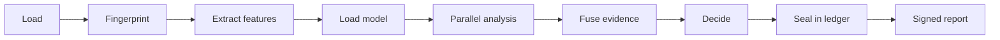
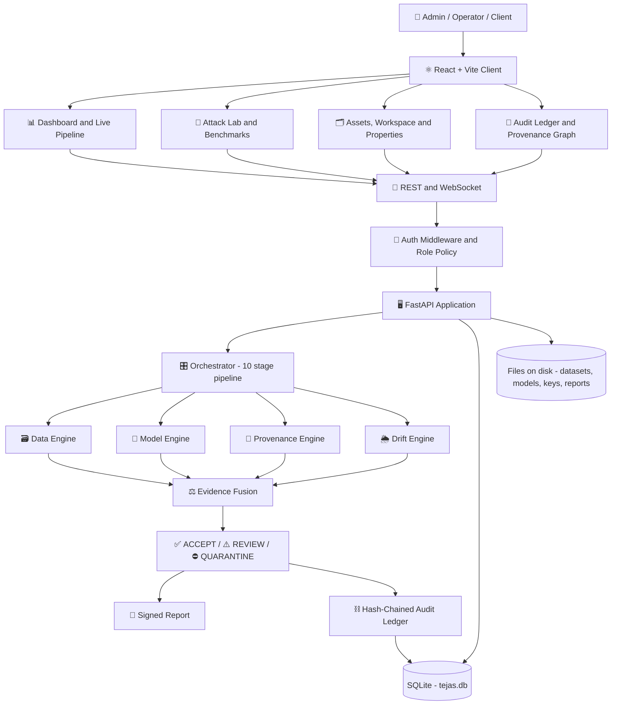
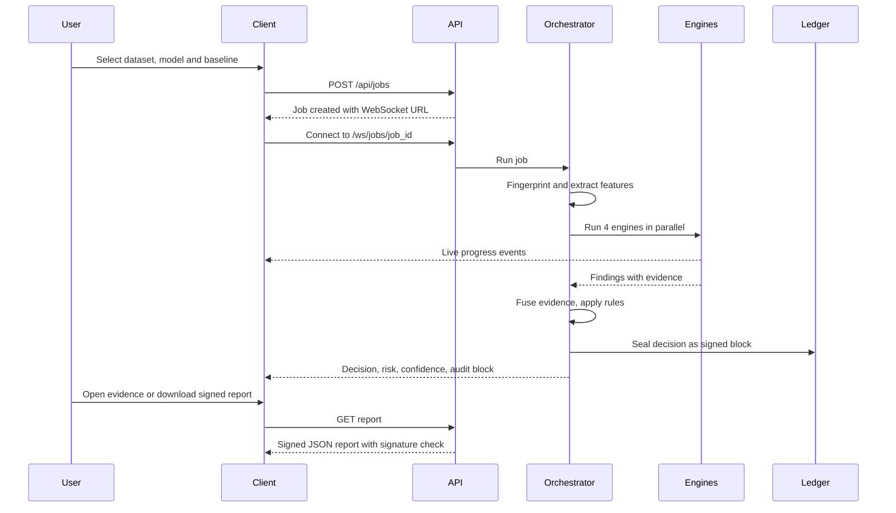
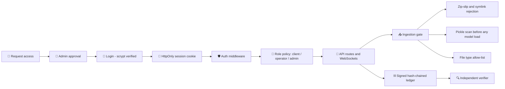

<div align="center">


<br/>

**An offline assurance layer that verifies the data, the model and the outputs of a computer-vision pipeline, then proves every decision.**

<br/>


<br/><br/>

[Overview](#1-overview) ·
[Features](#2-key-features) ·
[How it works](#3-how-it-works) ·
[Architecture](#4-architecture) ·
[Getting started](#7-getting-started) ·
[Usage](#9-usage) ·
[Security](#10-security-and-access-control) ·
[Testing](#11-testing-and-benchmarks) ·
[Roadmap](#14-roadmap)

</div>

---

## Table of Contents

1. [Overview](#1-overview)
2. [Key Features](#2-key-features)
3. [How It Works](#3-how-it-works)
4. [Architecture](#4-architecture)
5. [Tech Stack](#5-tech-stack)
6. [Project Structure](#6-project-structure)
7. [Getting Started](#7-getting-started)
8. [Configuration](#8-configuration)
9. [Usage](#9-usage)
10. [Security and Access Control](#10-security-and-access-control)
11. [Testing and Benchmarks](#11-testing-and-benchmarks)
12. [Troubleshooting](#12-troubleshooting)
13. [Project Status and Limitations](#13-project-status-and-limitations)
14. [Roadmap](#14-roadmap)
15. [Contributing](#15-contributing)
16. [License](#16-license)

---

## 1. Overview

Computer-vision systems depend on datasets, pretrained models and third-party components whose integrity is usually **assumed rather than verified**. A poisoned dataset, a hidden backdoor or a silently swapped model can make a system fail exactly when it matters, and without evidence nobody can tell what went wrong.

**TEJAS-CV** sits around an existing computer-vision pipeline. It does **not** replace the pipeline and it does not retrain anything. It independently examines the **dataset**, the **model**, the **inference outputs** and the **contributors**, fuses the evidence into an explainable risk score, returns **ACCEPT**, **REVIEW** or **QUARANTINE**, and seals every decision into a signed, hash-chained audit ledger.

Everything runs **offline**. There are no network calls at runtime.

| Step | What TEJAS-CV does |
|---|---|
| **Detect** | Four parallel engines screen the data, the model, the provenance and the distribution shift |
| **Explain** | Every finding carries a reason, evidence, confidence, severity and a recommendation |
| **Prove** | SHA-256 fingerprints, Merkle proofs, Ed25519 signatures and a hash-chained ledger, checkable by an independent verifier |
| **Decide** | Evidence fusion returns ACCEPT, REVIEW or QUARANTINE with the rules that fired |

### Verdicts at a glance

| Scenario | What happens | Verdict |
|---|---|---|
| Trusted pipeline | Clean batch, approved model, valid provenance | ✅ **ACCEPT** |
| Dataset poisoning | Trigger-patch poisoning, label conflicts, files altered after signing | ⛔ **QUARANTINE** |
| Model substitution or backdoor | A validly signed model hiding a trigger backdoor | ⛔ **QUARANTINE** |
| Silent weight tampering | Same architecture, modified weights | ⛔ **QUARANTINE** |
| Inference tampering | A stored inference output edited after the fact | ⛔ **QUARANTINE** |
| Distribution shift | Night, haze or blur batch | ⚠️ **REVIEW** (drift is not an attack) |
| Malformed or malicious upload | Path traversal, no images, malicious pickle, disallowed file type | 🚫 **REJECTED** at ingestion |
| Replayed inference record | A valid record presented a second time | 🚫 **REJECTED** |

---

## 2. Key Features

### 🔎 Assurance engines
- **Data Integrity:** unreadable files, exact and near duplicates, cross-label conflicts, class-distribution shift, label consistency, recurring trigger-artifact screening, per-label outliers, contributor attribution
- **Model Integrity:** pickle scan, signed trusted-registry comparison, structural inspection, behavioural fingerprint, controlled trigger testing with attack-success-rate reporting
- **Provenance and Tamper Evidence:** Merkle re-hash of datasets, signed manifests, contributor signatures, inference chain and ledger verification
- **Shift and Drift:** out-of-distribution rate, MMD permutation test, KS tests and named environmental conditions

### 🔗 Cryptographic audit trail
- SHA-256 per file and a Merkle root per dataset
- Ed25519-signed, hash-chained audit blocks
- Signed assurance reports, training records and benchmark results
- An **independent verifier** that imports no TEJAS-CV code

### 🧪 Built-in test lab
- Six reproducible attack scenarios with an **Execute all** option and live step highlighting
- A real CNN trainer (NumPy backpropagation, exported to ONNX), optionally trained on poisoned data
- Benchmark suites scored against signed answer keys
- Synthetic test packs with known outcomes: ACCEPT, REVIEW, QUARANTINE and REJECTED

### 👥 Access control
- Request-access flow with administrator approval
- Three roles: **Admin**, **Operator** and **Client**
- Every upload, training run, assessment and inference is attributed to the account that performed it

### 🗺️ Forensics and visibility
- Live pipeline view driven by WebSocket events
- Provenance graph showing people, data sources, engines, the decision and the sealed block, with timestamps
- Per-image **Properties** dialog: General, Digital Signatures, Security, Details and Previous Versions
- Command-centre dark interface and a public landing page

---

## 3. How It Works

### Job pipeline



### The four engines

| Engine | Examines | Example findings |
|---|---|---|
| **Data Integrity** | Dataset files, labels, statistics | Conflicting duplicates, recurring trigger artifact, label inconsistency, suspicious contributor |
| **Model Integrity** | Model file and behaviour | Pickle with dangerous imports, weights modified, substitution, trigger anomaly |
| **Provenance and Tamper** | Hashes, signatures, chains | Manifest mismatch, files changed after signing, altered inference record, compromised ledger |
| **Shift and Drift** | Distribution versus a clean baseline | High out-of-distribution rate, MMD shift, night, haze or blur conditions |

### Fusion and decision rules

Engine scores are combined with noisy-OR, then weighted. Thresholds: **ACCEPT** below 35, **REVIEW** from 35 to 69, **QUARANTINE** from 70, plus explicit rules that are always reported:

| Rule | Effect |
|---|---|
| **R1** | Any critical evidence leads to QUARANTINE |
| **R2** | A high-confidence model or provenance integrity failure leads to QUARANTINE |
| **R3** | Two or more high data findings lead to QUARANTINE (one leads to REVIEW) |
| **R4** | A model without a trusted fingerprint is never auto-accepted (at least REVIEW) |
| **R5** | Significant distribution shift leads to REVIEW |
| **R6** | Drift alone never causes QUARANTINE |

Confidence is reduced when some checks could not run (coverage).

---

## 4. Architecture

### System architecture



### Assessment workflow



---

## 5. Tech Stack

| Layer | Technology | Purpose |
|---|---|---|
| Backend | Python 3.10+, FastAPI, Uvicorn | REST and WebSocket API |
| Data | SQLAlchemy, SQLite (WAL) | Embedded database, no server required |
| Analysis | ONNX Runtime, NumPy, SciPy | Model inference, statistics, CNN trainer |
| Images | Pillow, ImageHash | Image handling and perceptual hashing |
| Trust | `cryptography` (Ed25519), SHA-256, Merkle trees | Signatures, fingerprints, inclusion proofs |
| Accounts | scrypt (standard library) | Password hashing |
| Frontend | React, TypeScript, Vite | User interface and build tooling |
| UI libraries | Tailwind CSS, Framer Motion, Recharts, React Flow, TanStack Query | Styling, motion, charts, provenance graph, data fetching |
| Testing | pytest | Backend test suite |

*Optional:* PyTorch for TorchScript models, and DINOv2 (local weights) for stronger embeddings.

---

## 6. Project Structure

```bash
tejas-cv/
│
├── backend/
│   ├── app/
│   │   ├── api/             # REST and WebSocket routers
│   │   ├── auth/            # Password hashing, sessions, role policy, middleware
│   │   ├── core/            # hashing, merkle, keys, ledger, events, actor
│   │   ├── engines/         # data, model, provenance, drift, behaviour probes
│   │   ├── fusion/          # Evidence fusion and decision rules
│   │   ├── adapters/        # ONNX, TorchScript, pickle scanner, detection adapter
│   │   ├── features/        # Image statistics and embedders
│   │   ├── formats/         # CIFAR-10, GTSRB, corruptions, COCO, YOLO
│   │   ├── attacks/         # Dataset, model and inference attack generators
│   │   ├── ml/              # NumPy CNN, trainer, demo data
│   │   ├── benchmarks/      # Metrics (AUROC, TPR at fixed FPR)
│   │   ├── orchestrator/    # 10-stage job pipeline
│   │   ├── services/        # ingestion, baseline, inference, jobs, demo
│   │   ├── demo/            # Reproducible attack-lab data generator
│   │   ├── config.py
│   │   ├── database.py
│   │   └── main.py
│   │
│   ├── scripts/             # Command-line tools (see Usage)
│   ├── tests/               # pytest suite
│   ├── benchmarks/          # catalog.yaml (public dataset catalogue)
│   ├── requirements.txt
│   ├── requirements-dev.txt
│   └── Dockerfile
│
├── frontend/
│   ├── public/
│   ├── src/
│   │   ├── api/             # API client, endpoints, query keys
│   │   ├── realtime/        # Shared event socket and job stream
│   │   ├── components/
│   │   ├── pages/
│   │   ├── landing/         # Public landing page
│   │   └── types/
│   ├── package.json
│   └── vite.config.ts
│
├── docs/
│   └── banner.svg           # Animated README banner
│
├── start-backend.ps1
├── start-frontend.ps1
├── docker-compose.yml
└── README.md
```

> Runtime data lives in `backend/data/` (database, keys, datasets, models, reports). It is created automatically and should be git-ignored.

---

## 7. Getting Started

### 7.1 Prerequisites

| Requirement | Version |
|---|---|
| Python | 3.10 or newer (64-bit) |
| Node.js | 20 or newer (current LTS recommended) |
| Git | any recent version |

### 7.2 Clone the repository

```bash
git clone https://github.com/LoganthP/SIH2026.git tejas-cv
cd tejas-cv
```

### 7.3 Set up and start the backend

**Windows (PowerShell):**

```powershell
cd backend
python -m venv .venv
.venv\Scripts\Activate.ps1
pip install -r requirements-dev.txt
python -m uvicorn app.main:app --host 127.0.0.1 --port 8000
```

If PowerShell blocks the activation script, run once: `Set-ExecutionPolicy -Scope CurrentUser RemoteSigned`

**Linux / macOS:**

```bash
cd backend
python3 -m venv .venv
source .venv/bin/activate
pip install -r requirements-dev.txt
python -m uvicorn app.main:app --host 127.0.0.1 --port 8000
```

Expected output:

```text
INFO:     Uvicorn running on http://127.0.0.1:8000 (Press CTRL+C to quit)
INFO:     Application startup complete.
```

> The module is `app.main:app` (not `app:app`). Avoid `--reload` during demos, because each restart drops live connections.
> On Windows you can start the backend from the repository root with `.\start-backend.ps1`.

### 7.4 Set up and start the frontend

In a second terminal:

```bash
cd frontend
npm install
npm run dev
```

Open **http://127.0.0.1:5173**. The Vite dev server proxies `/api` and `/ws` to the backend, so no extra configuration is needed. On Windows: `.\start-frontend.ps1`.

### 7.5 First run

1. Open `http://127.0.0.1:5173` and choose **Request access**.
2. Create the first account. **The first account ever created becomes the administrator.** Every later sign-up is a pending request that an administrator approves.
3. Sign in and open **Attack Lab**, then press **Initialise Attack Lab** (about 10 seconds).
4. Run the scenarios, or use the split button to **Execute all remaining steps**.

Interactive API documentation is available at **http://127.0.0.1:8000/docs**.

*Locked out?* Create or reset an administrator from the command line:

```bash
cd backend
python scripts/create_admin.py --username your.name
```

### 7.6 Docker (optional, backend only)

```bash
docker compose up --build
```

### 7.7 Production build of the frontend

```bash
cd frontend
npm run build
```

Serve the `dist/` folder from any static file server. No external assets are required, so it works offline. Set `VITE_API_URL` when the API is on a different origin.

---

## 8. Configuration

All settings are optional.

| Variable | Default | Description |
|---|---|---|
| `TEJAS_HOME` | `backend/data` | Where the database, keys, datasets, models and reports are stored |
| `TEJAS_CORS` | `http://localhost:5173,http://127.0.0.1:5173` | Allowed frontend origins |
| `TEJAS_EMBEDDER` | `auto` | `auto`, `handcrafted` or `dinov2` |
| `TEJAS_MAX_SAMPLES` | `2000` | Maximum images analysed per job |
| `TEJAS_AUTH_REQUIRED` | `1` | Leave on. `0` exists only for automated tests |
| `TEJAS_DINOV2_REPO` | none | Local DINOv2 repository path |
| `TEJAS_DINOV2_WEIGHTS` | none | Local DINOv2 weights file |
| `VITE_API_URL` | `http://127.0.0.1:8000` | Frontend only: API origin for a production build |

<details>
<summary><strong>Using DINOv2 embeddings offline</strong></summary>

<br/>

1. On a connected machine, clone `facebookresearch/dinov2` and download the `dinov2_vits14_pretrain.pth` weights.
2. Copy both to the offline machine and set:

```env
TEJAS_EMBEDDER="dinov2"
TEJAS_DINOV2_REPO="/path/to/dinov2"
TEJAS_DINOV2_WEIGHTS="/path/to/dinov2_vits14_pretrain.pth"
```

3. Rebuild the baseline. If DINOv2 is not configured, the built-in handcrafted embedder is used and every report says so.

</details>

<details>
<summary><strong>Offline installation of Python packages</strong></summary>

<br/>

```bash
# On a connected machine
pip download -r requirements.txt -d wheelhouse

# On the offline machine
pip install --no-index --find-links wheelhouse -r requirements.txt
```

</details>

---

## 9. Usage

### 9.1 Guided demo

1. **Attack Lab:** initialise the lab.
2. Run the six steps one by one, or **Execute all remaining steps**.
3. **Live Pipeline:** watch the four engines run in parallel, then fusion, decision and the sealed audit block.
4. **Evidence:** read the reason, evidence and recommendation behind each finding.
5. **Provenance:** see who uploaded, trained, assessed and sealed what, with timestamps.
6. **Audit Ledger:** after the simulated insider edit in Step 6, run **Verify entire chain** and **Independent Verification**.
7. Press **Restore demo edits** to return to a healthy ledger.

### 9.2 Workspace

The Workspace guides **Data, Model, Assess and Insights**:

- **Data:** upload your own archive (classification folders, YOLO or COCO), pick an existing dataset, ingest a generated test pack, or use the demo sets.
- **Model:** choose an existing model, train one on your dataset, or upload an ONNX or TorchScript file.
- **Assess:** pick a baseline and an optional trusted model, then run the assessment with the live pipeline.
- **Insights:** decision, per-engine scores, flagged samples, drift analysis, provenance and a signed report.

Dataset archives use a class-folder layout:

```text
archive.zip
├── class_a/
│   ├── img_001.png
│   └── img_002.png
├── class_b/
│   └── img_001.png
├── manifest.json        # optional, signed by the contributor
└── manifest.sig         # optional
```

### 9.3 Command-line tools

Run from `backend/` with the virtual environment active.

| Script | Purpose |
|---|---|
| `scripts/run_demo.py` | Six-scenario attack lab, no server needed |
| `scripts/train_model.py` | Train a CNN (optionally with a poisoned trigger), register it, optionally approve it |
| `scripts/audit.py` | Run one assessment and print the verdict with evidence |
| `scripts/make_attack.py` | Generate dataset or model attacks with a signed answer key |
| `scripts/run_benchmark.py` | `ci`, `smoke` and `standard` suites scored against ground truth |
| `scripts/test_packs.py` | Generate synthetic packs covering ACCEPT, REVIEW, QUARANTINE and REJECTED |
| `scripts/calibrate.py` | Fit a baseline on clean data and measure false alarms on a hold-out set |
| `scripts/fetch_datasets.py` | Download public datasets (internet-connected machine only) |
| `scripts/import_dataset.py` | Offline, hash-verified import of CIFAR-10, GTSRB, CIFAR-10-C, COCO and YOLO data |
| `scripts/verify_independent.py` | Independent re-verification of the ledger, inference chain, files and reports |
| `scripts/create_admin.py` | Create or reset an administrator |

```bash
python scripts/run_demo.py --reset
python scripts/train_model.py --demo-data --name cnn-clean --trust aerial-cnn-v1
python scripts/run_benchmark.py --suite smoke
python scripts/test_packs.py all --scale small
python scripts/verify_independent.py --rehash-files
```

### 9.4 API overview

Full interactive documentation: `http://127.0.0.1:8000/docs`

| Area | Endpoints |
|---|---|
| Accounts | `POST /api/auth/signup` · `POST /api/auth/login` · `POST /api/auth/logout` · `GET /api/auth/me` |
| Assets | `POST /api/assets/datasets` · `POST /api/assets/models` · `GET /api/assets` |
| Assessments | `POST /api/jobs` · `GET /api/jobs/{id}/summary` · `/findings` · `/report` · `/provenance-graph` |
| Live updates | `WS /ws/jobs/{id}` · `WS /ws/events` |
| Inference | `POST /api/inference` · `POST /api/inference/attest` · `POST /api/inference/verify-chain` |
| Ledger | `GET /api/audit` · `POST /api/audit/verify` |
| Training | `POST /api/ml/train` |
| Benchmarks | `POST /api/benchmarks/runs` · `GET /api/benchmarks/results` |
| Lab | `POST /api/demo/bootstrap` · `POST /api/demo/scenarios/{name}` |
| System | `GET /api/system/status` · `POST /api/system/verify-independent` |

---

## 10. Security and Access Control



### 10.1 Roles

| Capability | Admin | Operator | Client |
|---|:---:|:---:|:---:|
| View dashboards, evidence, provenance, ledger | ✅ | ✅ | ✅ |
| Run assessments, run inference, verify chains | ✅ | ✅ | ✅ |
| Ingest datasets, upload models, build baselines | ✅ | ✅ | ❌ |
| Train models, run benchmarks | ✅ | ✅ | ❌ |
| Approve a model as trusted | ✅ | ❌ | ❌ |
| Attack Lab, tamper, restore and reset tools | ✅ | ❌ | ❌ |
| Manage users and approve access | ✅ | ❌ | ❌ |

### 10.2 Safeguards

- **Default deny:** every write route requires an administrator unless it is explicitly allowed for a lower role
- **Sessions:** random 256-bit tokens, and only their SHA-256 is stored on the server
- **Lockout:** five failed logins lock an account for five minutes
- **Passwords:** at least 10 characters, letters and digits, and not containing the username
- **Separation of duties:** operators can ingest and train, but only administrators can approve a model as trusted
- **Ingestion gate:** archives are checked for path traversal and symlinks, model files for dangerous pickle imports, and uploads against a file-type allow-list
- **Evidence for rejections:** every rejected upload is sealed in the ledger with its file hash and the reason

---

## 11. Testing and Benchmarks

### 11.1 Automated tests

```bash
cd backend
pytest -q
```

The suite covers cryptography, ledger tamper detection, every attack scenario, the API and WebSocket contract, roles and access policy, training, benchmarks and sample properties.

Frontend checks:

```bash
cd frontend
npm run build
npm run lint
```

### 11.2 Benchmarks

Every benchmark row is a real pipeline run scored against a signed answer key:

- Sample-level precision and recall for poisoned files
- Model-level backdoor detection (AUROC, TPR at 5% FPR)
- Drift verdicts and named-condition accuracy
- Inference edit and replay detection
- A generated **Known weak spots** section

Attacked files get neutral names, the answer key is stored outside the dataset, and baselines are fitted on a separate clean split.

```bash
python scripts/run_benchmark.py --suite ci        # about 30 seconds
python scripts/run_benchmark.py --suite smoke     # about 2 minutes
```

### 11.3 Test packs

```bash
python scripts/test_packs.py all --scale medium   # small | medium | large | xl
```

Generates upload-ready archives and models with an answer key covering **ACCEPT, REVIEW, QUARANTINE and REJECTED**, then ingests, analyses and scores each case.

### 11.4 Model training

TEJAS-CV audits models, so it does not need to train them. For demos and benchmarks it includes a small CNN trainer so the models under test are genuinely trained:

- NumPy backpropagation with Adam, exported to standard **ONNX**
- Gradients unit-tested against finite differences, and ONNX output checked against NumPy
- Optional BadNets-style poisoning with a chosen trigger, with the measured attack success rate recorded
- A signed training record sealed into the ledger for every run

### 11.5 Independent verification

```bash
python scripts/verify_independent.py --rehash-files
```

Re-checks the ledger, inference chain, stored files and signed reports using only the standard library, the `cryptography` package and the platform's public key. It can also be run from the **Audit Ledger** page.

---

## 12. Troubleshooting

<details>
<summary><strong>Common problems and fixes</strong></summary>

<br/>

| Problem | Fix |
|---|---|
| `Error loading ASGI app. Attribute "app" not found` | Use `app.main:app` and run from inside `backend/` |
| `ModuleNotFoundError: app` | You are not in the `backend` folder |
| Port 8000 already in use | Add `--port 8001` and update `VITE_API_URL` |
| `onnxruntime` fails to install | Use a 64-bit Python 3.10 or newer |
| Frontend shows 401 or "login required" | Sign in, or create the first account |
| Every assessment is QUARANTINE | The audit ledger is flagged as compromised (for example after a demo tamper). Use **Restore demo edits** or **Reset lab** |
| `WinError 145` while building the lab | Close any Explorer window open inside `backend\data`, then use **Reset lab** |
| Strange state after experiments | `python scripts/run_demo.py --reset`, or **Reset lab** in the UI |
| Locked out of every account | `python scripts/create_admin.py --username your.name` |

</details>

---

## 13. Project Status and Limitations

### ✅ Validated
- Automated backend test suite (pytest), including tamper detection, role enforcement and every attack scenario
- The independent verifier detects direct edits made to the database
- Ed25519 signatures verify with OpenSSL
- Fully offline operation

### ⚠️ Known limitations
- **Trigger testing screens a fixed bank** of patch triggers. In our own benchmark, a learned backdoor with a red centre patch was caught only by comparing against the approved model, not by zero-trust screening alone. Blended and signal-style triggers are also weak spots.
- **The ledger is blockchain-style:** signed, hash-chained blocks with Merkle roots on a single node. It makes tampering evident and provable, but it is not a distributed consensus network.
- **Demo data is synthetic by design** so that results are reproducible. Thresholds were set on it and should be recalibrated on real reference data.
- **The default embedder is handcrafted.** Stronger results need local DINOv2 weights.
- **The signing key is stored locally.** A production deployment should keep it in an HSM or KMS.
- Drift results indicate operational change, not malicious intent.

---

## 14. Roadmap

- [ ] Trigger reverse-engineering to catch triggers outside the fixed bank
- [ ] DINOv2 embeddings by default
- [ ] Real-data benchmark reports (CIFAR-10, GTSRB, COCO)
- [ ] Full object-detection assurance (YOLO and COCO engines)
- [ ] Hardware-backed key management
- [ ] Periodic export of the ledger head to write-once media
- [ ] Optional PostgreSQL backend for multi-user deployments
