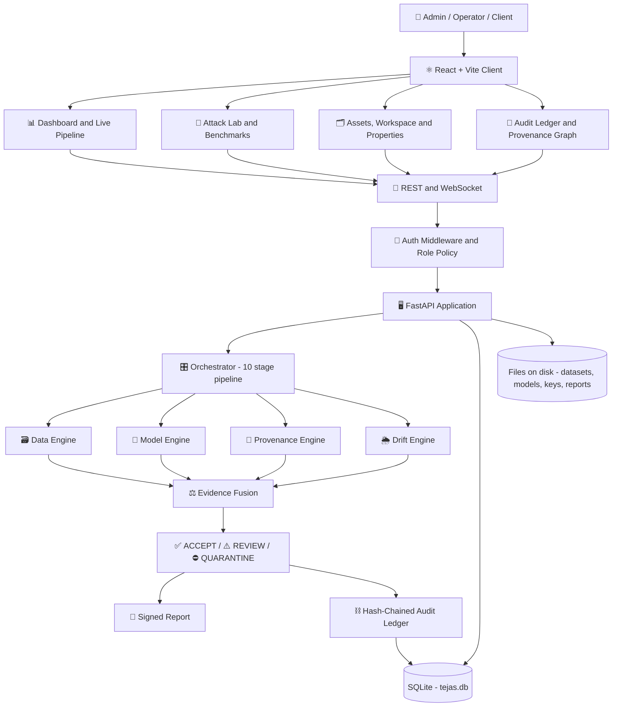
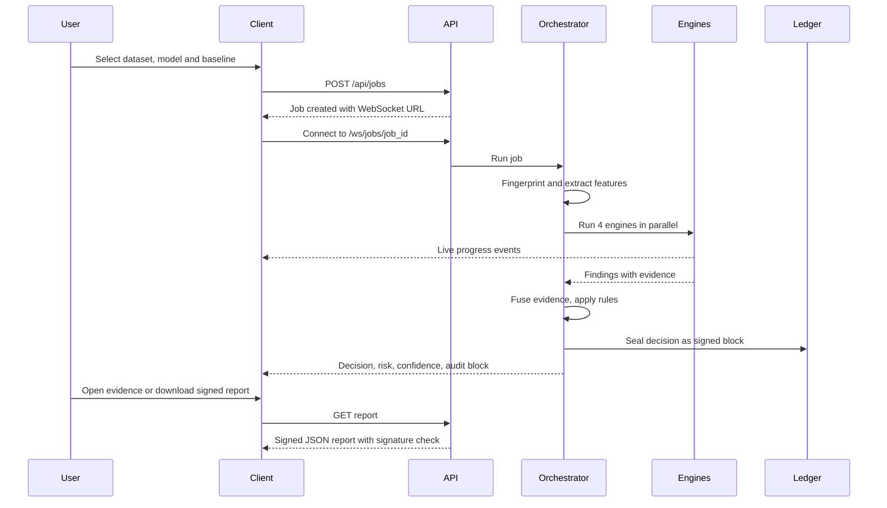
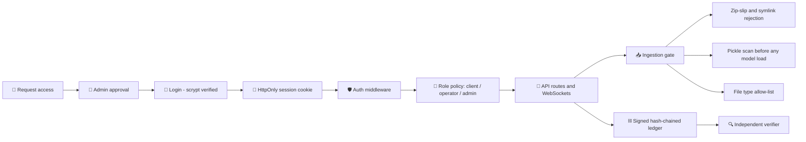

<div align="center">


### Offline AI-Integrity Assurance for Computer-Vision Systems

**Smart India Hackathon 2026 · Team Jai Hind · Problem Statement SIH26228**


**DETECT • EXPLAIN • PROVE • DECIDE**

*From "Trust me" to "Prove it."*

</div>

# ✨ Overview

**TEJAS-CV** is an offline assurance layer that sits around an existing computer-vision pipeline. It does **not** replace the pipeline or retrain anything. It independently verifies the **dataset**, the **model**, the **inference outputs** and the **contributors**, fuses the evidence into an explainable risk score, returns **ACCEPT / REVIEW / QUARANTINE**, and seals every decision into a signed, hash-chained audit ledger.

It combines:
- 🛡️ Four parallel assurance engines (Data, Model, Provenance, Drift)
- 🔍 Poisoning, backdoor, substitution and tampering detection
- 🧾 Explainable findings: every one carries a reason, evidence, confidence, severity and recommendation
- 🔗 A signed, hash-chained audit ledger with Merkle roots
- 🧪 A built-in attack lab, CNN trainer and ground-truth benchmark harness
- 👥 Role-based access (Admin / Operator / Client) with an approval workflow
- 📴 100% offline operation: no network calls at runtime

> *Data → Model → Inference → Evidence → Decision*

---

# 🚀 Core Features

## 🔎 Four Assurance Engines
- **Data Integrity:** unreadable files, exact and near duplicates, cross-label conflicts, class-distribution shift, kNN label consistency, recurring trigger-artifact screening, per-label outliers, contributor attribution
- **Model Integrity:** pickle scan, signed trusted-registry comparison (substitution vs weight tampering), custom-op and input-shortcut inspection, behavioural fingerprint, controlled trigger testing with attack-success-rate reporting
- **Provenance & Tamper:** dataset Merkle re-hash, signed manifest verification, contributor signatures, inference chain and audit ledger verification
- **Shift & Drift:** out-of-distribution rate, MMD permutation test, KS tests, named environmental conditions (night, haze, blur). *Drift is never treated as an attack.*

## ⚖️ Evidence Fusion & Decision
- Noisy-OR engine scores, weighted fusion, explicit and reported decision rules (R1–R6)
- `ACCEPT` below 35 · `REVIEW` 35–69 · `QUARANTINE` 70 and above, with rule overrides
- Confidence is reduced when checks were unavailable (coverage)

## 🔗 Cryptographic Audit Trail
- SHA-256 per file, Merkle root per dataset
- Ed25519-signed, hash-chained audit blocks
- Signed assurance reports, signed training records, signed benchmark results
- **Independent verifier** that imports no TEJAS-CV code and re-checks the database from scratch

## 🧪 Attack Lab & Benchmarks
- Six reproducible scenarios: clean, poisoned, model substitution, weight tamper, inference tamper, drift
- One-click **Execute all** with live step highlighting
- Real CNN trainer (NumPy backprop, exported to ONNX), optionally trained on poisoned data with a chosen trigger
- Benchmark suites (`ci`, `smoke`, `standard`) scored against signed red-team answer keys
- Test packs with known outcomes: **ACCEPT, REVIEW, QUARANTINE and REJECTED**

## 👥 Access Management
- Request-access flow with administrator approval
- Three roles: **Admin**, **Operator**, **Client**
- Every upload, training run, assessment and inference is attributed to the account that did it
- Profile editing and role-change requests

## 🗺️ Provenance & Forensics
- Provenance graph showing people, data sources, engines, the decision and the sealed audit block, with timestamps
- Per-image **Properties** dialog: General, Digital Signatures, Security, Details, Previous Versions
- Live pipeline view driven by WebSocket events

## 🌙 Premium UI/UX
- Command-centre dark glass interface
- Role-aware, lock-and-explain controls
- Live updates, no manual refresh
- Public landing page with Log in / Request access

---

# 🧠 System Architecture



---

# ⚡ System Workflow



---

# 🏗️ Tech Stack

| Technology | Purpose |
|---|---|
| Python 3.10+ | Backend runtime |
| FastAPI + Uvicorn | REST and WebSocket API |
| SQLAlchemy + SQLite (WAL) | Embedded database, no server required |
| ONNX Runtime | Model inference and analysis |
| NumPy / SciPy | Statistics, MMD, CNN trainer |
| Pillow / ImageHash | Image handling, perceptual hashing |
| `cryptography` | Ed25519 signatures |
| SHA-256 + Merkle trees | Fingerprints and inclusion proofs |
| scrypt (stdlib) | Password hashing |
| PyYAML | Dataset catalogue |
| React + TypeScript | Frontend UI |
| Vite | Build tool and dev proxy |
| Tailwind CSS | Styling |
| Framer Motion | Animations |
| Recharts | Charts |
| React Flow | Provenance graph |
| TanStack Query | Data fetching and caching |
| pytest | Backend tests |

*Optional:* PyTorch for TorchScript models, DINOv2 (local weights) for stronger embeddings.

---

# 📂 Project Structure

```bash
SIH2026/
│
├── backend/
│   ├── app/
│   │   ├── api/             # REST + WebSocket routers (auth, assets, jobs, ml, ...)
│   │   ├── auth/            # Password hashing, sessions, role policy, middleware
│   │   ├── core/            # hashing, merkle, keys, ledger, events, actor
│   │   ├── engines/         # data, model, provenance, drift + behaviour probes
│   │   ├── fusion/          # Evidence fusion and decision rules
│   │   ├── adapters/        # ONNX, TorchScript, pickle scanner, detection adapter
│   │   ├── features/        # Image statistics and embedders
│   │   ├── formats/         # CIFAR-10, GTSRB, corruptions, COCO, YOLO
│   │   ├── attacks/         # Dataset, model and inference attack generators
│   │   ├── ml/              # NumPy CNN, trainer, demo data
│   │   ├── benchmarks/      # Metrics (exact AUROC, TPR at FPR)
│   │   ├── orchestrator/    # 10-stage job pipeline
│   │   ├── services/        # ingestion, baseline, inference, jobs, demo
│   │   ├── demo/            # Reproducible attack-lab data generator
│   │   ├── config.py
│   │   ├── database.py
│   │   └── main.py
│   │
│   ├── scripts/             # run_demo, train_model, audit, run_benchmark, test_packs, ...
│   ├── tests/               # pytest suite
│   ├── benchmarks/          # catalog.yaml (public dataset catalogue)
│   ├── requirements.txt
│   ├── requirements-dev.txt
│   └── Dockerfile
│
├── frontend/
│   ├── public/
│   ├── src/
│   │   ├── api/             # client, endpoints, query keys
│   │   ├── realtime/        # shared event socket, job stream
│   │   ├── components/
│   │   ├── pages/
│   │   ├── landing/         # public landing page
│   │   └── types/
│   ├── package.json
│   └── vite.config.ts
│
├── start-backend.ps1
├── start-frontend.ps1
├── docker-compose.yml
├── README.md
└── .gitignore
```

> Runtime data (`backend/data/`: database, keys, datasets, models, reports) is created automatically and is git-ignored.

---

# 🔐 Security Architecture



- **Default deny:** every write route requires admin unless it is explicitly listed for a lower role
- **Sessions:** random 256-bit tokens; only their SHA-256 is stored server-side
- **Lockout:** 5 failed logins lock an account for 5 minutes
- **Passwords:** at least 10 characters, letters and digits, must not contain the username
- **Separation of duties:** operators can ingest and train; only admins can approve a model as trusted
- **Rejected uploads leave evidence:** each rejection is sealed in the ledger with the file hash and reason

## 👥 Roles

| Capability | Admin | Operator | Client |
|---|:---:|:---:|:---:|
| View dashboards, evidence, provenance, ledger | ✅ | ✅ | ✅ |
| Run assessments, run inference, verify chains | ✅ | ✅ | ✅ |
| Ingest datasets, upload models, build baselines | ✅ | ✅ | ❌ |
| Train models, run benchmarks | ✅ | ✅ | ❌ |
| Approve a model as trusted | ✅ | ❌ | ❌ |
| Attack Lab, tamper / restore / reset | ✅ | ❌ | ❌ |
| Manage users and approve access | ✅ | ❌ | ❌ |

---

# 🧪 Verdicts at a Glance

| Scenario | What happens | Verdict |
|---|---|---|
| Trusted pipeline | Clean batch, approved model, valid provenance | ✅ **ACCEPT** |
| Dataset poisoning | Trigger-patch poisoning, label conflicts, files altered after signing | ⛔ **QUARANTINE** |
| Model substitution / backdoor | A validly signed model hiding a trigger backdoor | ⛔ **QUARANTINE** |
| Silent weight tampering | Same architecture, modified weights | ⛔ **QUARANTINE** |
| Inference tampering | A stored inference output edited after the fact | ⛔ **QUARANTINE** |
| Distribution shift | Night, haze or blur batch | ⚠️ **REVIEW** (drift is not an attack) |
| Malformed or malicious upload | Zip-slip, no images, malicious pickle, disallowed file type | 🚫 **REJECTED** at ingestion |
| Replayed inference record | A valid record presented a second time | 🚫 **REJECTED** |

---

# 🔐 Environment Variables

## 🖥️ Backend (all optional)

```env
TEJAS_HOME="./data"                 # database, keys, datasets, models, reports
TEJAS_CORS="http://localhost:5173,http://127.0.0.1:5173"
TEJAS_EMBEDDER="auto"               # auto | handcrafted | dinov2
TEJAS_MAX_SAMPLES=2000              # images analysed per job
TEJAS_AUTH_REQUIRED=1               # leave on; 0 is for automated tests only
```

*Optional DINOv2 (offline, local weights):*

```env
TEJAS_EMBEDDER="dinov2"
TEJAS_DINOV2_REPO="/path/to/dinov2"
TEJAS_DINOV2_WEIGHTS="/path/to/dinov2_vits14_pretrain.pth"
```

## 🌐 Frontend

```env
VITE_API_URL="http://127.0.0.1:8000"
```

> The Vite dev server also proxies `/api` and `/ws` to `127.0.0.1:8000`, so this is only needed for a separate production build.

---

# 🚀 Backend Setup Guide

## 📁 Required Folder Structure

```bash
backend/
│
├── app/
├── scripts/
├── tests/
├── requirements.txt
└── requirements-dev.txt
```

---

### ⚙️ Step 1 — Create a Virtual Environment

**Windows (PowerShell):**

```powershell
cd backend
python -m venv .venv
.venv\Scripts\Activate.ps1
```

If PowerShell blocks the script, run once: `Set-ExecutionPolicy -Scope CurrentUser RemoteSigned`

**Linux / macOS:**

```bash
cd backend
python3 -m venv .venv
source .venv/bin/activate
```

---

### 📦 Step 2 — Install Dependencies

```bash
pip install -r requirements-dev.txt
```

---

### ▶️ Step 3 — Start the Server

```bash
python -m uvicorn app.main:app --host 127.0.0.1 --port 8000
```

> The module is `app.main:app` (not `app:app`). Avoid `--reload` during demos: every restart drops live connections.

Windows shortcut from the repository root: `.\start-backend.ps1`

---

# ✅ Expected Output

```bash
INFO:     Uvicorn running on http://127.0.0.1:8000 (Press CTRL+C to quit)
INFO:     Application startup complete.
```

---

### 🧪 Step 4 — Verify the Backend

Open:

```bash
http://127.0.0.1:8000/docs
```

You should see the interactive API documentation. `http://127.0.0.1:8000/api/health` returns a healthy status.

---

### 👤 Step 5 — Create the Administrator

Login is **on by default**. The **first account ever created becomes the administrator**; every later sign-up is a pending request that an admin must approve.

1. Start the frontend (below) and open `http://127.0.0.1:5173`
2. Choose **Request access** and create the first account
3. Sign in, open **Attack Lab**, and press **Initialise Attack Lab**

*Locked out?* Recover from the command line:

```bash
python scripts/create_admin.py --username your.name
```

---

# 🔄 Full Startup Commands

```bash
# Backend
cd backend
python -m venv .venv
.venv\Scripts\Activate.ps1
pip install -r requirements-dev.txt
python -m uvicorn app.main:app --host 127.0.0.1 --port 8000

# Frontend (second terminal)
cd frontend
npm install
npm run dev
```

---

## ❗ If Something Goes Wrong

| Problem | Fix |
|---|---|
| `Error loading ASGI app. Attribute "app" not found` | Use `app.main:app`, run from inside `backend/` |
| `ModuleNotFoundError: app` | You are not in the `backend` folder |
| Port 8000 already in use | Add `--port 8001` and update `VITE_API_URL` |
| `onnxruntime` fails to install | Use a 64-bit Python 3.10 to 3.12 |
| Frontend shows 401 / "login required" | Sign in, or create the first account |
| Every job is QUARANTINE | The audit ledger is flagged as compromised (for example after a demo tamper). Use **Restore demo edits** or **Reset lab** |
| `WinError 145` while building the lab | Close Explorer windows open inside `backend\data`, then Reset lab |
| Strange state after experiments | `python scripts/run_demo.py --reset` or **Reset lab** in the UI |

---

# 🛠️ Installation

## Clone Repository

```bash
git clone https://github.com/LoganthP/SIH2026.git
cd SIH2026
```

---

## Install Backend

```bash
cd backend
python -m venv .venv
.venv\Scripts\Activate.ps1
pip install -r requirements-dev.txt
```

---

## Install Frontend

```bash
cd ../frontend
npm install
```

---

# ▶️ Run Development Environment

## Start Backend

```bash
cd backend
python -m uvicorn app.main:app --host 127.0.0.1 --port 8000
```

---

## Start Frontend

```bash
cd frontend
npm run dev
```

Open `http://127.0.0.1:5173`

---

# 🚀 Production Build

## Build Frontend

```bash
cd frontend
npm run build
```

Serve `dist/` from any static file server. No external assets are needed; the app works offline.

---

## Run Backend (Docker, optional)

```bash
docker compose up --build
```

---

# 🎬 Demo Guide

1. **Attack Lab → Initialise** (about 10 s)
2. Run steps 1 to 6, or open the split button and choose **Execute all remaining steps**
3. Watch the **Live Pipeline**: four engines run in parallel, then fusion, decision and the sealed audit block
4. Open **Evidence** for the reason, evidence and recommendation behind each finding
5. Open **Provenance** to see who uploaded, trained, assessed and sealed what, with timestamps
6. After Step 6 (a simulated insider edits a ledger block), open **Audit Ledger → Verify entire chain** and **Independent Verification**
7. Press **Restore demo edits** to return to a healthy ledger

---

# 🧰 Scripts

Run from `backend/` with the virtual environment active.

| Script | Purpose |
|---|---|
| `scripts/run_demo.py` | Six-scenario attack lab, no server needed |
| `scripts/train_model.py` | Train a CNN (optionally with a poisoned trigger), register it, optionally approve it |
| `scripts/audit.py` | Run one assessment and print the verdict with evidence |
| `scripts/make_attack.py` | Generate dataset/model attacks with a signed answer key |
| `scripts/run_benchmark.py` | `ci` / `smoke` / `standard` suites scored against ground truth |
| `scripts/test_packs.py` | Generate large synthetic packs covering ACCEPT, REVIEW, QUARANTINE and REJECTED |
| `scripts/calibrate.py` | Fit a baseline on clean data and measure false alarms on a hold-out set |
| `scripts/fetch_datasets.py` | Download public datasets (internet-connected machine only) |
| `scripts/import_dataset.py` | Offline, hash-verified import of CIFAR-10, GTSRB, CIFAR-10-C, COCO, YOLO |
| `scripts/verify_independent.py` | Independent re-verification of the ledger, inference chain, files and reports |
| `scripts/create_admin.py` | Create or reset an administrator |

```bash
python scripts/run_demo.py --reset
python scripts/train_model.py --demo-data --name cnn-clean --trust aerial-cnn-v1
python scripts/run_benchmark.py --suite smoke
python scripts/test_packs.py all --scale small
python scripts/verify_independent.py --rehash-files
```

---

# 🤖 Model Training & Benchmarks

## Training

TEJAS-CV **audits** models; it does not need to train them. For demos and benchmarks it includes a small CNN trainer so the models under test are genuinely trained:

- Pure NumPy backpropagation with Adam, exported to standard **ONNX**
- Gradients are unit-tested against finite differences; the ONNX output matches NumPy
- Optional **BadNets-style poisoning** with a chosen trigger (position, colour, rate, target class)
- The *measured* attack success rate is recorded for every poisoned run
- Every run writes a **signed training record** sealed into the audit ledger

## Benchmarks

Every benchmark row is a real pipeline run scored against a signed red-team answer key:

- Sample-level precision and recall for poisoned files
- Model-level trojan detection (AUROC, TPR at 5% FPR)
- Drift verdicts and named-condition accuracy
- Inference edit and replay detection
- A generated **Known weak spots** section, listed honestly

Attacked files get neutral names, the answer key is stored outside the dataset, and baselines are fitted on a separate clean split.

---

# 🔥 Performance Optimizations

- ⚡ Four engines run in parallel
- ⚡ Cached feature extraction and per-file facts
- ⚡ Stratified sampling for large datasets (configurable)
- ⚡ One shared WebSocket event stream with back-off and replay
- ⚡ Event-driven UI refresh instead of constant polling
- ⚡ Paginated and virtualised lists
- ⚡ Thread-safe lab bootstrap that is robust on Windows

---

# 📈 Prototype Status

## ✅ Validated

- Backend automated test suite (pytest): cryptography, ledger tamper detection, all scenarios, API and WebSocket contract, roles and access policy, training, benchmarks, sample properties
- Independent verifier detects direct SQL edits to the ledger
- Ed25519 signatures verify with OpenSSL
- Fully offline operation (no external network dependency)

## ⚠️ Known Limitations

- **Trigger testing screens a fixed bank** of patch triggers. In our own benchmark, a learned backdoor with a red centre patch was caught only by comparing against the approved model, not by zero-trust screening alone. Blended and signal-style triggers are also weak spots.
- **The ledger is blockchain-style:** signed, hash-chained blocks with Merkle roots on a single node. It makes tampering evident and provable; it is not a distributed consensus network.
- **Demo data is synthetic by design** (reproducible). Thresholds were set on it and should be recalibrated on real reference data.
- **Default embedder is handcrafted.** Stronger results need local DINOv2 weights.
- **The signing key is stored locally.** Production use should move it to an HSM or KMS.
- Drift results indicate operational change, not malicious intent.

## 🔭 Follow-Up Work

- Neural-Cleanse-style trigger reverse-engineering to catch out-of-bank triggers
- DINOv2 embeddings by default
- HSM-backed signing keys
- Periodic export of the ledger head to write-once media
- Larger real-data benchmark runs (CIFAR-10, GTSRB, COCO)

---

# 🧪 Smoke Tests

```bash
cd backend
pytest -q
python scripts/run_demo.py --reset
python scripts/run_benchmark.py --suite ci
python scripts/verify_independent.py --rehash-files
```

- Authentication and role enforcement
- Request-access approval flow
- All six attack-lab scenarios reach their expected verdicts
- Dataset and model rejection at the ingestion gate
- Ledger tamper → detect → restore
- Inference edit and replay detection
- Image Properties for demo and newly uploaded datasets
- Frontend: `npm run build` and `npm run lint`

---

# 🌟 Future Roadmap

- 📡 Real-data benchmark reports on public datasets
- 🧠 Trigger reverse-engineering for novel backdoors
- 🎯 Full object-detection assurance (YOLO / COCO engines)
- 🔐 Hardware-backed key management
- 🗄️ Optional PostgreSQL backend for multi-user deployments
- 📱 Mobile-friendly console

---

Please run `pytest -q` (backend) and `npm run build && npm run lint` (frontend) before opening a pull request.
# 📜 License

This project is licensed under the MIT License.
